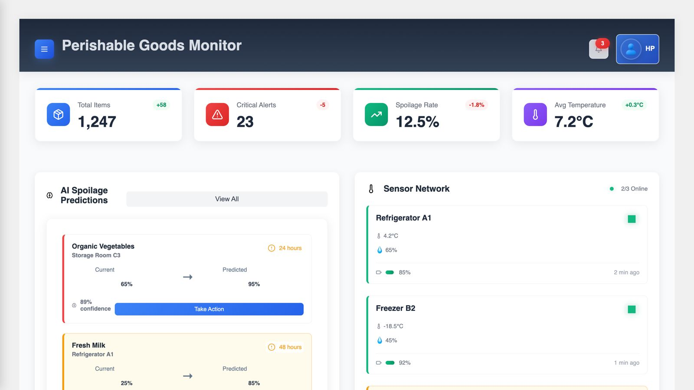

# 🧊 Perishable Goods Monitoring System

A real-time, AI-powered platform for monitoring, predicting, and minimizing spoilage of perishable goods across the cold chain. Inspired by Walmart’s Eden AI, this solution offers SKU-level insights, cold storage monitoring, and predictive analytics to reduce waste and optimize efficiency.

---

## 📽 Demo Video

🎥 [Watch the Demo on YouTube](https://youtu.be/HFAOeIFVTmw)

---

## 🖼️ Screenshot



---

## 🚀 Features

- **Live Dashboard**: Monitor total items, alerts, spoilage rate, and cold storage stats in real time.
- **AI Spoilage Predictions**: Get early warnings on items at risk with confidence scores.
- **Sensor Network Integration**: Track temperature & humidity from multiple zones.
- **Smart Alerts**: Receive critical warnings and actionable suggestions (e.g. discount or dispose).
- **Historical Analytics**: Understand trends and recurring spoilage patterns for better planning.

---

## 🧠 Tech Stack

| Layer     | Technology                                   |
| --------- | -------------------------------------------- |
| Frontend  | React.js, Chart.js, Bootstrap                |
| Backend   | Flask / Node.js                              |
| Database  | MongoDB                                      |
| ML Models | Python (scikit-learn, XGBoost, pandas)       |
| DevOps    | Docker, Git, GitHub Actions (CI/CD optional) |

---

## 🛠️ Setup Instructions

```bash
# Clone the repository
git clone https://github.com/yourusername/perishable-goods-monitor.git
cd perishable-goods-monitor

# Backend Setup
cd backend
pip install -r requirements.txt
python app.py

# Frontend Setup
cd ../frontend
npm install
npm start
```

> 📡 Simulated sensor data or real IoT integrations can be configured in `/data/` or through MQTT/API endpoints.

---

## 👨‍💻 Contributors

**Harshit Parpe**
**Abhinav Dubey**
**Daksh Aggarwal**
**Chaitanya Singh**

---

## 📄 License

Licensed under the [MIT License](./LICENSE).

---
